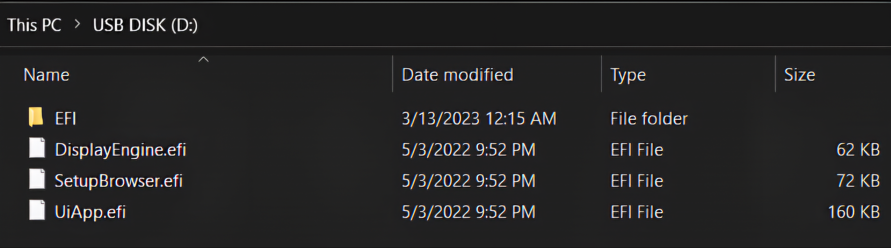

# Flechar BIOS? Para onde vamos, não precisamos de um flash de BIOS?

## O que esta ferramenta faz
Com esta ferramenta, você pode acessar e modificar o menu AMD PBS/AMD CBS e possivelmente fazer overclock da AMD sem precisar atualizar a BIOS, apenas inicializando a partir de um pendrive.

## Aviso Legal

Não me responsabilizo por quaisquer danos resultantes do uso desta ferramenta. Além disso, este é um backup do projeto original.

USE POR SUA CONTA E RISCO

**Ao usar esta ferramenta, você concorda com estas regras.**

**Pense duas vezes antes de fazer qualquer alteração.**

**Estas são configurações reais da BIOS, trate-as como tal.**

**Nem todas as opções visíveis funcionam ou devem ser usadas.**

**Isso é ainda real na versão BETA.**

Alterar as configurações pode danificar seu dispositivo permanentemente, portanto, manuseie com cuidado. Certifique-se de ter um método para recuperar seu dispositivo caso algo dê errado.  Para a maioria das opções, uma limpeza/resete da BIOS é suficiente. No entanto, para algumas configurações mais perigosas, pode ser necessário um flash de bios completa, motivo pelo qual são classificadas como "configurações perigosas".

# Problema Conhecido (Leia Isto)
* Usuários da Dell relataram que a BIOS normal não carrega mais após o uso deste procedimento:

Solução graças a (BIT_GAM3R e à Comunidade Gaming [Laptop Mod Discord](https://discord.gg/FDgUR5cpCg)):

Inicie a ferramenta, acesse o BootManager, exclua a opção Misc. Ela não deveria estar lá, pois foi criada por um bug.  Se você tentou acessar o BootManager antes...

Uma correção adequada será disponibilizada assim que estiver pronta.

* Não funciona nas versões da série 6000 (Rembrandt) dos dispositivos Onexplayer, AOKZOE e AYANEO.

## Configurações Perigosas
Configurações conhecidas que podem inutilizar seu dispositivo - Observe que isso se refere principalmente às APUs integradas "bloqueadas" de laptops/dispositivos portáteis, e não às APUs ou CPUs desbloqueadas de desktops.
* P0State Vid
* Otimizador de Curva para certas APUs, geralmente da série 5000 desbloqueada - no entanto, isso pode ser feito pelo Windows usando o [UXTU](UXTU) para todos os modelos afetados.

## Como funciona
O AMD PBS/AMD CBS e possivelmente o AMD Overclocking (Aod_Setup) exportam seu banco de dados HII independentemente do fabricante. Portanto, se pudermos carregá-los, poderemos acessar esses menus sem problemas.

Este pacote inclui dois componentes principais: um carregador e o componente de interface do usuário. Este último é construído a partir de um pacote edk2 padrão.
 Ao inicializar a partir do USB, o Loader irá desregistrar o FormBrowser da BIOS existente e carregará este personalizado, fornecendo a nova interface para esta inicialização.

A única desvantagem deste método é que você precisa inicializar a partir do USB para acessar esses menus.

## Como usar
Extraia os arquivos para um USB formatado em FAT32 e inicialize a partir dele. A interface da BIOS personalizada será carregada. Agora, se você abrir o Gerenciador de Dispositivos, o AMD PBS/CBS estará lá. Você pode modificar o que desejar e, quando terminar, basta pressionar Esc até que seja solicitado que você salve as alterações.

 Na BIOS da AMI, além do AMD PBS e CBS, também será exibida a opção "Configuração". Esta é a BIOS padrão; as alterações feitas aqui podem não ser salvas (AMD PBS/CBS, Configuração Aod).

# Opções Notáveis
* Overclocking de RAM + Latências - Funciona em APUs Picasso, Renior "U" e Luccine "U" até 3200 MHz, em APUs Renior "H" até 4400 MHz e no Steam Deck.

Pode funcionar em alguns modelos Rembrandt ou em APUs CZN HX e HS através do menu de overclocking da AMD; no entanto, todas essas APUs podem apresentar problemas, incluindo falhas.

Desativar o Gear Down Mode, o Power Down Mode e definir a taxa de comando parece funcionar em todas as APUs.

* Tamanho do buffer UMA - Funciona em todas as APUs e permite diferentes quantidades de "VRAM".

* Controle de FCLK - Funciona para Renior H e pode funcionar para Steam Deck, APUs CZN e Rembrandt.

 * Menu de Overclocking AMD - A maioria das configurações aqui presentes deve funcionar se o menu aparecer para você.

Para ter a melhor chance de falar comigo ou com o criador desta ferramenta, entre neste servidor: [Isle of Zen](https://discord.gg/isle-of-zen-772105072720871435)

Reportar problemas e perguntar sobre o funcionamento é melhor feito no canal #help-n-support.

## Doações

Se você deseja doar/apoiar, considere apoiar em:

[Patreon](https://www.patreon.com/SmokelessCPU)

Bitcoin: bc1qv09hxpge9tv6zl74778un0x7t7fjlql8h3842r

ETH:  0xE0EaeA32a24c1559E17ba374FD004823B1fbB15B

Observação: isto pertence ao criador original desta ferramenta, não a mim.

# Qualquer coisa que você ache que deva ser incluída acima, me avise.

## Download
[UniversalAMDFormBrowser](UniversalAMDFormBrowser.zip)

## Foto

* Esta deve ser a forma como o pendrive deve ser configurado: FAT32, com a pasta que você baixou descompactada e colocada na raiz do pendrive.

